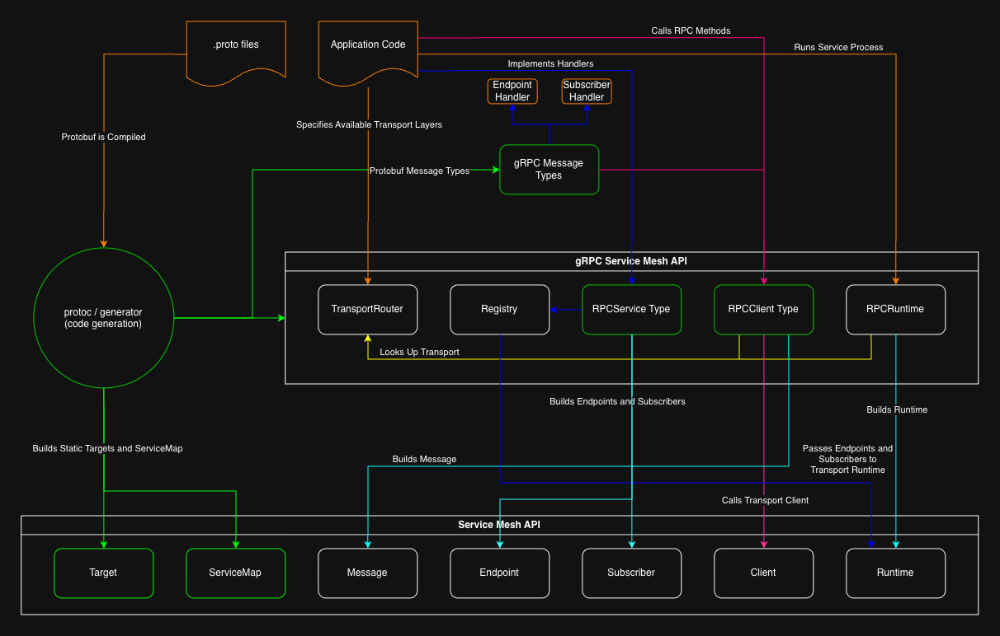

# gRPC Service Mesh API

The gRPC Service Mesh API is a service-mesh protocol layer specification 
built on the [Service Mesh API Specification](https://github.com/Paymentbox-com/service-mesh-api) and  
driven by Google Protocol Buffers. It specifies how protobuf message and service definitions are
translated into Service Mesh API primitives and consumed at the application level.

Using this specification, libraries can be implemented across programming languages to compile the same 
protobuf definitions into code that is compatible with the Service Mesh API and compatible with each other across 
transports and language specific runtimes.



## The Generator

The gRPC Service Mesh API uses a generator, which reads `protoc` output to generate the necessary code to consume the 
Service Mesh API. This specification defines how that generator interprets `.proto` files to generate that code.

## Definitions

The only inputs required for the gRPC Service Mesh API are `.proto` files and the descriptors the standard 
`protoc` compilers produce from them. The standard elements of a `.proto` file are translated into Service Mesh API 
primitives as described below. In addition, a few options are defined to further control how the `.proto` files are 
interpreted. 

### Options

The gRPC Service Mesh API uses protobuf's `Options` feature to specify details about the services defined in `.proto` 
files that cannot be specified by the protobuf syntax otherwise. These details include the `transport` intended to be used 
for any given set of services, the `Kind` a `Target`  and `Endpoint`/`Subscriber` generated from a service `rpc` method 
should be, the `deployment_group` for a given set of services if the conventional default needs to be overridden, and the 
`consumer_group` for any given `rpc` endpoint that is a `Subscriber`.

These options are defined in the generator, and are as follows:

```proto
syntax = "proto3";
package mesh;
import "google/protobuf/descriptor.proto";

enum Kind {
  ROUTE = 0;
  TOPIC = 1;
}

extend google.protobuf.MethodOptions {
  Kind kind = 50001;
  string consumer_group = 50002;
}

extend google.protobuf.FileOptions {
  string deployment_group = 50003;
  string transport = 50004;
}
```

| option             | set on   | meaning                                                                                 | default                |
|--------------------|----------|-----------------------------------------------------------------------------------------|------------------------|
| `kind`             | a method | `ROUTE` replies to each request; `TOPIC` does not reply                                 | `ROUTE`                |
| `consumer_group`   | a method | the `consumer_group` of the `Target` and the `Endpoint` or `Subscriber` generated from it | the `deployment_group` |
| `deployment_group` | a file   | the `deployment_group` of every service in the file's top-level directory and the directories nested in it | the top-level directory name |
| `transport`        | a file   | the transport the file's top-level directory is served over, as a string a library resolves at runtime; this specification does not enumerate transports | none; required |

No option is defined at the service or method level for `transport` or `deployment_group`, so a
service cannot be split across different values, which is by design. These options are intended to be set in 
their own file within the top-level directory to which they apply, such as `transport.proto` or `deployment.proto`.

Importing and using these options in your own `.proto` files is done like this:

```proto
// definitions/pbx/deployment.proto: the directory's settings and nothing else
syntax = "proto3";
package pbx;
import "mesh/options.proto";

option (mesh.transport) = "nats";
option (mesh.deployment_group) = "pbx";   // optional; the directory name is the default
```

```proto
// definitions/pbx/api_key.proto
syntax = "proto3";
package pbx;
import "mesh/options.proto";
import "google/protobuf/empty.proto";

message ApiKey {
  optional string first_name = 1;
}

service ApiKeyService {
  rpc Search(ApiKey) returns (ApiKey);                       // ROUTE by default
  rpc Created(ApiKey) returns (google.protobuf.Empty) {
    option (mesh.kind) = TOPIC;
    option (mesh.consumer_group) = "audit";
  }
}
```

`mesh/options.proto` is resolved through a `protoc --proto_path` entry, the same way `google/protobuf/*.proto`
is. It lives in this repository alongside the generator, which carries an embedded copy and adds it to `--proto_path`
when it runs `protoc`. A definitions project that runs `protoc` itself either vendors the file under its own
`definitions/mesh/` or points `--proto_path` at a checkout of this repository.

### Messages

The standard `protoc` compilers produce message type definitions for each message type defined in the `.proto` files 
they are aimed at. These generated types normally implement their own binary serialization, and are wrapped by a 
protocol layer type that packages that binary serialization up as the `Payload` of a Service Mesh API Message type.

The `Message` metadata carries `Content-Type: application/x-protobuf`. A topic method's declared return type,
conventionally `google.protobuf.Empty`, is never sent.

### Services

Protobuf services defined in `.proto` files have their `rpc` methods translated into Service Mesh API `Targets`, as well as
either an `Endpoint` or a `Subscriber`, depending on the `Kind` option set on the method.

The `Targets` of every service are compiled into one `ServiceMap` per `transport`, holding every `Target` whose
`transport` metadata names it, across all deployment groups that use that transport. A map is complete for its
transport: it holds one `Target` per `rpc` method of every service served over it, whether or not the process that
loads it implements any of them. Because the Service Mesh API binds both a `Runtime` and a `Client` to one
transport, the transport's map is what each of them is given. A process that reaches two transports holds two
`Clients`, each with its own map, and the `TransportRouter` picks between them by a `Target`'s `transport` metadata.

## Directories, deployment groups, and transports

The gRPC Service Mesh API convention is to have one directory contain the `.proto` files that define 
one `deployment_group`, with its name being the name of the `deployment_group`. Each of these directories 
lives inside a top level `definitions` directory the generator is pointed at. The `transport` rule and the 
`deployment_group` default apply to every top-level directory whose tree contains at least one `service`. A directory 
that holds only messages, such as `mesh/` or a vendored `google/`, is outside both rules, as are the imported 
`google/protobuf/*.proto` files.

Nested directories within a top-level directory inherit its `deployment_group` and `transport`, and set neither 
themselves.

Exactly one file in each top-level directory sets `transport`. The value is the name the application configures in the 
`TransportRouter` (described below) for that transport, for example `nats`. The generator copies the string into the 
generated code without interpreting it, and the `TransportRouter` resolves it at runtime.

```
definitions/
├── mesh/
│   └── options.proto          # this specification's options, imported by every file below
├── pbx/                       # deployment group "pbx"
│   ├── deployment.proto       # option (mesh.transport) = "nats"
│   ├── api_key.proto          # package pbx; ApiKeyService
│   └── internal/
│       └── audit.proto        # package pbx.internal; inherits deployment group "pbx" and transport "nats"
└── billing/                   # deployment group "billing"
    ├── deployment.proto       # option (mesh.transport) = "http"
    └── invoice.proto          # package billing; InvoiceService
```

## Generation

### Installing the generator

The generator is the Go program `grpc-service-mesh-gen` in this repository:

```sh
go install github.com/Paymentbox-com/grpc-service-mesh-api/cmd/grpc-service-mesh-gen@v0.1.1
```

or, without installing, `go run github.com/Paymentbox-com/grpc-service-mesh-api/cmd/grpc-service-mesh-gen@v0.1.1`
with the same flags. `grpc-service-mesh-gen --help` describes every flag.

One command generates everything for a definitions project:

```sh
grpc-service-mesh-gen --definitions definitions --out lib --lang go,ruby
```

It runs `protoc` for the message code of each requested language (Go with `paths=source_relative` into `lib/go`, 
Ruby into `lib/ruby`), a `protoc` run that writes one `FileDescriptorSet` for the whole `definitions` directory with 
`--include_imports --include_source_info`, and the mesh generator over that set. Embedded copies of `mesh/options.proto` 
and `google/rpc/*.proto` are added to `--proto_path`, so a definitions project need not vendor them. `protoc` and 
`protoc-gen-go` are found on `PATH`.

`--go-out <dir>` and `--ruby-out <dir>` place one language's output at that directory in place of `<out>/go` or 
`<out>/ruby`; `--out` stays the default for both. Each applies only to a language named in `--lang`:

```sh
grpc-service-mesh-gen --definitions definitions --go-out go/gen --ruby-out ruby/lib --lang go,ruby
```

The message runs treat this specification's own files as follows. `google/rpc/*.proto` are left out in both languages; 
their compiled forms come from the published packages, `google.golang.org/genproto/googleapis/rpc` in Go and the 
`googleapis-common-protos-types` gem in Ruby. The Go run leaves out `mesh/options.proto` and maps it to its compiled 
package in this repository, `github.com/Paymentbox-com/grpc-service-mesh-api/mesh`, so the message code of a Go 
definitions project imports that package and the project's module requires this one. The Ruby run includes 
`mesh/options.proto` and writes `mesh/options_pb.rb` under `lib/ruby`, because the message files protoc writes require 
it by that path.

A descriptor set written elsewhere is given with `--descriptors` in place of `--definitions`:

```sh
protoc --proto_path=definitions --include_imports --include_source_info \
       --descriptor_set_out=build/definitions.pb $(find definitions -name '*.proto')
grpc-service-mesh-gen --descriptors build/definitions.pb --out lib --lang go,ruby
```

`--include_imports` puts `mesh/options.proto` and `google/protobuf/descriptor.proto` inside the set, so the
generator reads the option values from the set alone and needs no compiled form of `options.proto`. Message classes
come from the standard `protoc` runs for each language, and the generated code refers to them by the names
those runs produce.

For each directory that contains at least one `service`, the generator writes one source file per requested language 
into that directory's generated package, beside the standard message code. A directory that holds only messages is 
valid and gets no file, and a definitions tree with no `service` at all produces no files. A `.proto` file at the 
definitions root that declares a `service`, or sets `transport` or `deployment_group`, is a generator error; services 
live in a directory under the root. A nested directory gets its own file in its own generated package, with the `deployment_group` 
and `transport` of its top-level directory. The file is overwritten on every run and should not be edited by hand. 
Generated code depends on the language library and on the Service Mesh API contract, but never on a transport-specific 
implementation.

A directory's generated package is the one the standard `protoc` run uses. In Go it is the `go_package` option. In a 
directory that declares a `service`, every file that declares a message, enum, extension, or service sets the same 
`go_package`; a file that declares none of these, such as `deployment.proto`, may omit it and lands in the directory's 
package. In Ruby it is the `ruby_package` option when set, honoured the same 
way protoc's Ruby generator honours it, and otherwise the module derived from the proto package.

### Root package

A definitions project spread over several directories produces one generated package per directory, and an 
application refers to each by its own import path or module. `--go-root-package <import path[;name]>` and 
`--ruby-root-module <Module>` each add one file at the language's output root that re-exports every generated 
identifier an application uses under one flat namespace. The per-directory packages remain the packages the message 
types and services belong to, and a root alias is the same type or value under a second name, so what goes on the 
wire is the directory package's message.

```sh
grpc-service-mesh-gen --definitions definitions --out lib --lang go,ruby \
    --go-root-package "github.com/Paymentbox-com/pmtbox_mesh;pmtboxmesh" --ruby-root-module PmtboxMesh
```

In Go the file is `<go out>/<name>.grpcmesh.go` with `package <name>`, where `<name>` is the last element of the 
import path unless given after `;` as in `go_package`. It imports every directory package that has generated code, as 
a blank import when nothing from a package is aliased so that its `init` registration is linked, and declares 
`type <Name> = <pkg>.<Name>` for every message type, nested ones included under protoc-gen-go's names such as 
`Outer_Inner`, and every enum type; `const <Value> = <pkg>.<Value>` for every enum value constant; and, for each 
service, `type <Service> = <pkg>.<Service>`, `var <Name>Client = <pkg>.<Name>Client`, and 
`var <Name>Targets = <pkg>.<Name>Targets`. The Go identifiers are the ones protoc-gen-go generates, computed with its 
own front end. The `servicemaps` package stays at `<go out>/servicemaps` and is imported by its own path.

In Ruby the file is `<ruby out>/<snake_case(Module)>_grpcmesh.rb`, for `PmtboxMesh` `pmtbox_mesh_grpcmesh.rb`. It 
requires every generated Ruby file by load-path name (the message files, each `<dir>_grpcmesh.rb`, `service_maps.rb`, 
and `mesh/options_pb.rb`) and defines `module <Module>` with `<Name> = ::<GeneratedModule>::<Name>` for every 
top-level message class, every top-level enum module, and each RPCService class, client class, and targets module, 
plus `ServiceMaps = ::ServiceMaps`. Nested messages and enums are reached through their parent constant. The generated 
module is the one protoc's Ruby generator uses, `ruby_package` when set and otherwise the PascalCased proto package.

The root file requires every aliased Go identifier, or Ruby constant, to be unique across the whole definitions tree. 
Two directories that both generate `ApiKey` are a generator error naming the identifier and both source files. A root 
package name equal to a directory package name, or a root module equal to a generated module (`Pbx`) or to 
`ServiceMaps`, is an error as well. With the root options set, the example under Usage also writes:

```
lib/go/pmtboxmesh.grpcmesh.go       package pmtboxmesh: ApiKey, ApiKeyService, ApiKeyClient, ApiKeyTargets
lib/ruby/pmtbox_mesh_grpcmesh.rb    PmtboxMesh::ApiKey, ::ApiKeyService, ::ApiKeyClient, ::ApiKeyTargets, ::ServiceMaps
```

### Generator errors

The generator stops with an error when:

* `transport` is unset, or set in more than one file, in a top-level directory
* `deployment_group` is set to two different values in one top-level directory
* `transport` or `deployment_group` is set in a nested directory
* a file at the definitions root declares a `service`, or sets `transport` or `deployment_group`
* an `rpc` method streams in either direction
* Go is requested and, in a directory that declares a `service`, a file that declares a message, enum, extension, or 
  service sets no `go_package`, or two files set different values
* a root package is requested and two files generate the same Go identifier, or the same Ruby constant; the error 
  names the identifier and both files
* the Go root package's name equals a directory package's name, or the Ruby root module equals a generated module or 
  `ServiceMaps`

### Targets

Each rpc method becomes one Service Mesh API `Target`, and how the attributes of a `Target` are derived is as follows:

| field      | value                                                                 |
|------------|-----------------------------------------------------------------------|
| `segments` | the proto package split on `.`, then the service name, then the method name |
| `kind`     | `:route` for `ROUTE`, `:topic` for `TOPIC`                            |
| `metadata` | `deployment_group` from the directory's option or its name, `transport` from the directory's option, and `consumer_group` from the method's option when set |

For the `ApiKeyService` shown under Options, in `definitions/pbx/` with `transport = "nats"`, the two `Target`s are:

| field      | `Search`                                       | `Created`                                                             |
|------------|------------------------------------------------|-----------------------------------------------------------------------|
| `segments` | `["pbx", "ApiKeyService", "Search"]`           | `["pbx", "ApiKeyService", "Created"]`                                 |
| `kind`     | `:route`                                       | `:topic`                                                              |
| `metadata` | `deployment_group=pbx`, `transport=nats`       | `deployment_group=pbx`, `transport=nats`, `consumer_group=audit`      |

Targets are built at generation time and emitted as constants. Nothing reads
options at runtime.

### ServiceMaps

A `ServiceMap` is simply a list of `Targets`, as defined by the Service Mesh API Specification. The gRPC Service Mesh API 
requires one `ServiceMap` per `transport`, each holding only the `Targets` using that `transport`. The transport's map is 
what an `RPCRuntime` hands to the underlying `Runtime` and what a `Client` for that transport accepts on construction.

The per-transport `ServiceMap`s are written to one package at the output root per language. In Go it is 
`servicemaps/servicemaps.go`, package `servicemaps`, exporting one `mesh.ServiceMap` var per transport named by 
PascalCasing the transport string, such as `servicemaps.Nats`. In Ruby it is `service_maps.rb`, defining 
`ServiceMaps::<TRANSPORT>` with the transport string in SCREAMING_SNAKE_CASE, such as `ServiceMaps::NATS`. That package 
imports the directory packages for their `Target` values.

### RPCService Types

For each service defined in a `.proto` file, the generator emits an `RPCService` type, which provides a way for each of that service's 
`rpc` method handlers to be implemented by application code. It then outputs `Endpoints` and/or `Subscribers` that contain those handlers, 
and they are what the transport-specific `Runtime` ingests.

The handlers for `Endpoints` and `Subscribers` differ in their return value:

| kind    | handler signature                                                                                                        |
|---------|--------------------------------------------------------------------------------------------------------------------------|
| `ROUTE` | `(context, <RequestType>) -> (<ResponseType>) [May return or raise a MeshError, depending on language/implementation]`   |
| `TOPIC` | `(context, <RequestType>) [May return or raise a MeshError, depending on language/implementation]`                       |

`<RequestType>` and `<ResponseType>` are the `rpc` method's input and output message classes as produced by the standard `protoc`
run for that language.

An application implements only the method handlers it intends to serve. Decoding the inbound Service Mesh API `Message` 
into the proper type, and encoding a response type back into a `Message` is handled automatically so that the 
application doesn't need to touch the underlying layer.

### RPCClient Types

For each service the generator also emits an `RPCClient` type with one method per `rpc` method, through which
callers reach the service. The `RPCService` type keeps the service name, `ApiKeyService`. The client and targets names 
are the service name with one trailing `Service` stripped, then `Client` or `Targets` appended: `ApiKeyClient` and 
`ApiKeyTargets`. A name that would be empty after stripping is kept whole. The method's signature for each client 
side method mirrors the handler on the service side:

| kind    | client method signature                   langua                                                                   | Service Mesh API operation |
|---------|--------------------------------------------------------------------------------------------------------------|----------------------------|
| `ROUTE` | `(context, Request) -> (Response) [May return or raise a MeshError, depending on ge/implementation]`   | `Request`                  |
| `TOPIC` | `(context, Request) [May return or raise a MeshError, depending on language/implementation]`                 | `Publish`                  |

A `ROUTE` or `TOPIC` method encodes the standard, generated type into a `Message` addressed to the method's `Target` and sends that
message through the appropriate transport-specific client that implements the Service Mesh API specification. A `ROUTE` 
method will get a `Message` back and decode it back into the standard, generated response type.

An `RPCClient` holds no connection of its own. On each call it must resolve the transport-specific `Client` that
serves the `Target`'s transport using the `TransportRouter` (described below).

## Non-generated Types

Each language-specific implementation of this specification will need to implement the following types, which are not 
generated off of `.proto` files.

### TransportRouter

The `TransportRouter` provides the transport-specific `Client` and `Runtime` implementations for any given `transport` 
option. It is a single, process-wide object the application configures at boot with one entry per transport name its 
definitions use. Generated code for services whose `transport` has no entry fails at runtime. Nothing generated takes 
the `TransportRouter` as an argument; a generated client is called directly and resolves the transport-specific `Client` 
through the process router on each call. Each language-specific implementation of this specification documents how the 
`TransportRouter` is configured.

### Registry

The `Registry` is a single, process-wide object that collects every implemented `Endpoint` and `Subscriber` the process 
will serve. The application registers its implemented `RPCService` values in it at boot, and nothing generated takes the 
`Registry` as an argument. This specification defines what it does; each language-specific implementation of this 
specification documents how services are registered.

### RPCRuntime

The `RPCRuntime` is what a service-mesh application calls to begin listening for messages, and it is a wrapper around a 
transport-specific Service Mesh API `Runtime` implementation. It should either wrap or expose the underlying implementation's
functionality.

An `RPCRuntime` is constructed for a single `transport` and a single `deployment_group`. At construction it asks the 
`Registry` for the implemented `Endpoints` and `Subscribers` whose `Targets` carry its `deployment_group`, obtains the 
transport-specific `Runtime` implementation from the `TransportRouter`, and hands it those `Endpoints` and `Subscribers` 
together with the transport's `ServiceMap`. Nothing else reaches the underlying `Runtime`. `Start`, `Stop`, and `Running` 
delegate to it. Services registered after construction are not served by that `RPCRuntime`. A process holds one 
`RPCRuntime` per transport.

### MeshError

`MeshError` is the error type every implementation provides for application failures, and the type an `RPCService` 
handler produces and an `RPCClient` produces when a reply carries one. It wraps the standard `google.rpc.Status` message 
and adds what the language needs to treat it as an error.

| member       | meaning                                                                                  |
|--------------|------------------------------------------------------------------------------------------|
| `code`       | a `google.rpc.Code`                                                                      |
| `message`    | human-readable text                                                                      |
| `details`    | the wrapped message's `details`, any number of packed messages of any type               |
| `proto`      | the wrapped `google.rpc.Status`                                                          |

A `MeshError` is constructed from a code, a message, and zero or more detail messages, or from a 
`google.rpc.Status` message. It is the language's error type: in Go it implements `Error`, in Ruby it descends from 
`StandardError`, and so on. Each language-specific implementation documents its language-specific features.

The compiled classes for `google.rpc.Status`, `google.rpc.Code`, and the detail types in `google/rpc/error_details.proto` 
are a dependency of each implementation, taken from the standard published packages for the language. The `.proto` 
files themselves ship with this specification so that a definitions project can put them on 
its `--proto_path`.

## Error Handling

Every call through an `RPCClient` may produce a `MeshError`, the type defined above. Errors from the Service Mesh API 
and from the transport, such as no receiver for a `Target` or a request timeout, are surfaced to the caller unchanged; 
this specification does not map them into a `MeshError`.

**Language boundary.** How a handler produces a `MeshError` and how a caller receives one is language-specific,
because error handling is language-specific. A Go handler returns it as its error value and a Go caller inspects the 
returned error, while a Ruby handler raises it and a Ruby caller rescues it. Each implementation documents its idiomatic 
mechanism. Regardless of language, any `MeshError` a handler produces is sent on the transport layer as a `google.rpc.Status`, 
which is then parsed on the client side and turned back into a `MeshError` to be handled in the idiomatic way for the 
language of the client side code.

**Reporting.** A `ROUTE` handler reports an application failure by producing a `MeshError` in place of a response, and a 
language-specific implementation should provide an idiomatic way of doing this. The `RPCService` then sends a reply whose 
payload is the encoded `google.rpc.Status` and whose metadata carries `Grpc-Status` set to the code as a decimal integer. 
A `ROUTE` handler that fails in any other way is reported as `UNKNOWN` with the failure's text as the message. A `TOPIC` 
handler has no caller, so it handles application errors itself; nothing it returns reaches the publisher, and what an 
implementation does when one fails is documented by that implementation.

**Custom errors.** A consumer may define its own error types as ordinary messages in its definitions and attach them
to a `MeshError` through `details`, and a language-specific implementation may provide helper functions or other support 
for doing this. `google/rpc/error_details.proto` provides common detail types such as `ErrorInfo`, `BadRequest`, and 
`RetryInfo`. Custom errors are defined as protobuf messages so that they can be used across languages.

**Decoding.** An `RPCClient` reads `Grpc-Status` from the reply metadata before touching the payload. If it is set, the 
payload is a `google.rpc.Status` and a `MeshError` is produced. If it is not set, the payload is the method's response type. A payload that does not decode as
the expected type produces an `INTERNAL` `MeshError` from the `RPCClient` method.

## Installation

Three pieces are installed: the generator, the library for each language an application is written in, and a 
transport of the application's choice. The versions below are the current tags.

### The generator

```sh
go install github.com/Paymentbox-com/grpc-service-mesh-api/cmd/grpc-service-mesh-gen@v0.1.1
```

or, without installing, `go run github.com/Paymentbox-com/grpc-service-mesh-api/cmd/grpc-service-mesh-gen@v0.1.1` 
with the same flags. The generator runs `protoc` and, when Go is requested, `protoc-gen-go`, both found on `PATH`:

```sh
go install google.golang.org/protobuf/cmd/protoc-gen-go@latest
```

### Go

```sh
go get github.com/Paymentbox-com/grpc-service-mesh-go@v0.3.0
```

The library imports `github.com/Paymentbox-com/service-mesh-go/mesh`, `google.golang.org/protobuf`, and 
`google.golang.org/genproto/googleapis/rpc`, which arrive with it. The transport is a separate module the application 
adds; the NATS transport is `github.com/Paymentbox-com/service-mesh-nats-go`, package `nats`:

```sh
go get github.com/Paymentbox-com/service-mesh-nats-go@v0.2.0
```

### Ruby

The gems `grpc_service_mesh`, `service_mesh`, and `service_mesh_nats` come from their repositories at a tag. 
`service_mesh` is a dependency of `grpc_service_mesh`, and Bundler needs its git source spelled out in the Gemfile. 
`googleapis-common-protos-types` comes from rubygems.org and provides `Google::Rpc::Status`, `Google::Rpc::Code`, and 
the detail types in `google/rpc/error_details.proto`, such as `Google::Rpc::ErrorInfo`.

```ruby
# Gemfile
gem "grpc_service_mesh", git: "https://github.com/Paymentbox-com/grpc-service-mesh-ruby", tag: "v0.2.0"
gem "service_mesh", git: "https://github.com/Paymentbox-com/service-mesh-ruby", tag: "v0.2.0"
gem "googleapis-common-protos-types"
gem "service_mesh_nats", git: "https://github.com/Paymentbox-com/service-mesh-nats-ruby", tag: "v0.2.0"
```

`service_mesh_nats` is the NATS transport; another transport gem takes its place in an application that uses a 
different transport.

## Usage

The examples use the `pbx.ApiKeyService` shown under Options, served over the transport named `nats` in the deployment 
group `pbx`, with `go_package` set to `example.com/definitions/lib/go/pbx`.

### A definitions project

A definitions project holds the `.proto` files and the code generated from them. `mesh/options.proto` comes from the 
generator's embedded copy; a copy vendored under `definitions/mesh/` is accepted as well.

```
definitions/
└── pbx/
    ├── deployment.proto   # option (mesh.transport) = "nats"; sets no go_package
    └── api_key.proto      # package pbx; option go_package = "example.com/definitions/lib/go/pbx"; ApiKeyService
lib/
└── go/
    └── go.mod             # module example.com/definitions/lib/go
```

One command generates everything:

```sh
grpc-service-mesh-gen --definitions definitions --out lib --lang go,ruby
```

It writes these files:

```
lib/go/pbx/api_key.pb.go            message code from protoc-gen-go
lib/go/pbx/deployment.pb.go         protoc-gen-go output for the settings file, in package pbx
lib/go/pbx/pbx.grpcmesh.go          ApiKeyTargets, ApiKeyService, ApiKeyClient
lib/go/servicemaps/servicemaps.go   servicemaps.Nats
lib/ruby/mesh/options_pb.rb         the options file the Ruby message code requires
lib/ruby/pbx/api_key_pb.rb          message code from protoc
lib/ruby/pbx/deployment_pb.rb       protoc output for the settings file
lib/ruby/pbx/pbx_grpcmesh.rb        Pbx::ApiKeyTargets, Pbx::ApiKeyService, Pbx::ApiKeyClient
lib/ruby/service_maps.rb            ServiceMaps::NATS
```

The Go message code imports `github.com/Paymentbox-com/grpc-service-mesh-api/mesh`, the compiled form of 
`mesh/options.proto`, so `go mod tidy` in `lib/go` records this module in `go.mod` beside 
`github.com/Paymentbox-com/grpc-service-mesh-go`, `github.com/Paymentbox-com/service-mesh-go`, and 
`google.golang.org/protobuf`. The Ruby files are loaded with `lib/ruby` on the load path, so `require "service_maps"` 
and `require "pbx/pbx_grpcmesh"` resolve.

### A Go application

The application configures the process router at boot with one entry per transport name, builds its transport's 
`Runtime` and `Client` in the entry's constructors, and registers the services it serves.

```go
import (
    "context"
    "errors"
    "os"
    "time"

    "github.com/Paymentbox-com/grpc-service-mesh-go/grpcmesh"
    "github.com/Paymentbox-com/service-mesh-go/mesh"
    "github.com/Paymentbox-com/service-mesh-nats-go/nats"
    "google.golang.org/genproto/googleapis/rpc/code"
    "google.golang.org/genproto/googleapis/rpc/errdetails"
    "google.golang.org/protobuf/proto"

    "example.com/definitions/lib/go/pbx"
    "example.com/definitions/lib/go/servicemaps"
)

err := grpcmesh.AddTransport("nats", grpcmesh.Transport{
    Config:     mesh.Config{nats.URLKey: os.Getenv("NATS_URL")},
    ServiceMap: servicemaps.Nats,
    NewRuntime: func(cfg mesh.Config, sm mesh.ServiceMap, e []mesh.Endpoint, s []mesh.Subscriber) (mesh.Runtime, error) {
        return nats.New(cfg, sm, e, s)
    },
    NewClient: func(cfg mesh.Config, sm mesh.ServiceMap) (mesh.Client, error) {
        return nats.NewClient(cfg, sm)
    },
})
```

A generated `RPCService` is a struct with one function field per `rpc` method. The application sets the ones it 
serves; a nil field is not served. A ROUTE handler returns the response or an error, and a `*grpcmesh.MeshError` is 
the application failure the caller receives.

```go
err = grpcmesh.Register(pbx.ApiKeyService{
    Search: func(ctx context.Context, req *pbx.ApiKey) (*pbx.ApiKey, error) {
        key, ok := store.Find(req.GetFirstName())
        if !ok {
            return nil, grpcmesh.NewNotFoundError("no such key",
                &errdetails.ErrorInfo{Reason: "KEY_MISSING", Domain: "pbx"})
        }
        return key, nil
    },
    Created: func(ctx context.Context, ev *pbx.ApiKey) error {
        return audit.Record(ev)
    },
})
```

`grpcmesh.NewRPCRuntime(transport, deploymentGroup)` builds the transport's runtime from the registered services of 
that deployment group. `Start`, `Stop`, and `Running` delegate to it.

```go
rt, err := grpcmesh.NewRPCRuntime("nats", "pbx")
if err != nil { /* grpcmesh.ErrUnknownTransport, grpcmesh.ErrDuplicateRuntime, or the transport constructor's error */ }
if err := rt.Start(ctx); err != nil { /* the transport's error */ }

drain, cancel := context.WithTimeout(context.Background(), 10*time.Second)
defer cancel()
_ = rt.Stop(drain)
```

A generated client is a package-level variable with one method per `rpc` method, called directly. A ROUTE method 
returns the decoded response or an error; a TOPIC method publishes and returns an error or nil. A `MeshError` the 
handler produced comes back as a `*grpcmesh.MeshError`, found with `errors.As`.

```go
key, err := pbx.ApiKeyClient.Search(ctx, &pbx.ApiKey{FirstName: proto.String("ada")})

var me *grpcmesh.MeshError
switch {
case err == nil:
    // key is the response
case errors.As(err, &me):
    // me.Code(), me.Message(), me.Details(); a detail unpacks with UnmarshalTo
    for _, d := range me.Details() {
        var info errdetails.ErrorInfo
        if d.UnmarshalTo(&info) == nil {
            _ = info.GetReason()
        }
    }
default:
    // a router, Service Mesh API, or transport error, unchanged
}

err = pbx.ApiKeyClient.Created(ctx, key)
```

### A Ruby application

The same shape in Ruby. `GrpcServiceMesh.add_transport` takes the transport's configuration Hash, the generated 
`ServiceMap`, and two lambdas that build the transport's `Runtime` and `Client`.

```ruby
require "grpc_service_mesh"
require "service_mesh_nats"
require "service_maps"
require "pbx/pbx_grpcmesh"

GrpcServiceMesh.add_transport("nats",
  config: {"url" => ENV.fetch("NATS_URL", "nats://127.0.0.1:4222")},
  service_map: ServiceMaps::NATS,
  runtime: ->(config, map, endpoints:, subscribers:) { ServiceMeshNats::Runtime.new(config, map, endpoints: endpoints, subscribers: subscribers) },
  client: ->(config, map) { ServiceMeshNats::Client.new(config, map) })
```

The generated `Pbx::ApiKeyService` declares the rpcs and serves nothing itself. The application subclasses it and 
defines a method for each rpc it serves, taking the decoded request and the inbound metadata Hash. A route method 
returns the response message and raises `GrpcServiceMesh::MeshError` for an application failure; a method the 
subclass does not define is not served.

```ruby
class ApiKeys < Pbx::ApiKeyService
  def initialize(store, audit)
    @store = store
    @audit = audit
  end

  def search(request, metadata)
    key = @store.find(request.first_name) or
      raise GrpcServiceMesh::NotFoundError.new("no such key",
        Google::Rpc::ErrorInfo.new(reason: "KEY_MISSING", domain: "pbx"))
    Pbx::ApiKey.new(first_name: key.first_name, last_name: key.last_name)
  end

  def created(request, metadata)
    @audit.record(request)
  end
end

GrpcServiceMesh.register(ApiKeys.new(store, audit))

runtime = GrpcServiceMesh::RPCRuntime.new(transport: "nats", deployment_group: "pbx")
runtime.start
at_exit { runtime.stop(10) }
```

Generated client methods are class methods taking the request and two keywords, `metadata:` for the outbound 
message's metadata and `options:` for the per-call Hash the transport's `request` or `publish` takes. A route method 
returns the decoded response and raises the `MeshError` a handler produced; a topic method returns `nil`.

```ruby
begin
  key = Pbx::ApiKeyClient.search(Pbx::ApiKey.new(first_name: "ada"),
    metadata: {"Request-Id" => SecureRandom.uuid},
    options: {"request_timeout" => "2"})
rescue GrpcServiceMesh::MeshError => e
  e.code    # :NOT_FOUND
  e.message # "no such key"
  info = e.details.find { |d| d.is(Google::Rpc::ErrorInfo) }&.unpack(Google::Rpc::ErrorInfo)
end

Pbx::ApiKeyClient.created(key, metadata: {"Event-Id" => "e1"})
```

Service Mesh API errors and the transport's own errors pass through both clients unchanged.

## Repositories

- [service-mesh-api](https://github.com/Paymentbox-com/service-mesh-api): the Service Mesh API Specification, the transport contract this specification builds on.
- [service-mesh-go](https://github.com/Paymentbox-com/service-mesh-go): the Go contract, module `github.com/Paymentbox-com/service-mesh-go`, package `mesh`.
- [service-mesh-nats-go](https://github.com/Paymentbox-com/service-mesh-nats-go): the Go transport over NATS, package `nats`.
- [service-mesh-ruby](https://github.com/Paymentbox-com/service-mesh-ruby): the Ruby contract, gem `service_mesh`, with the conformance suite transports run.
- [service-mesh-nats-ruby](https://github.com/Paymentbox-com/service-mesh-nats-ruby): the Ruby transport over NATS, gem `service_mesh_nats`.
- [grpc-service-mesh-api](https://github.com/Paymentbox-com/grpc-service-mesh-api): this specification and the generator `grpc-service-mesh-gen`.
- [grpc-service-mesh-go](https://github.com/Paymentbox-com/grpc-service-mesh-go): the Go library, package `grpcmesh`.
- [grpc-service-mesh-ruby](https://github.com/Paymentbox-com/grpc-service-mesh-ruby): the Ruby library, gem `grpc_service_mesh`.
