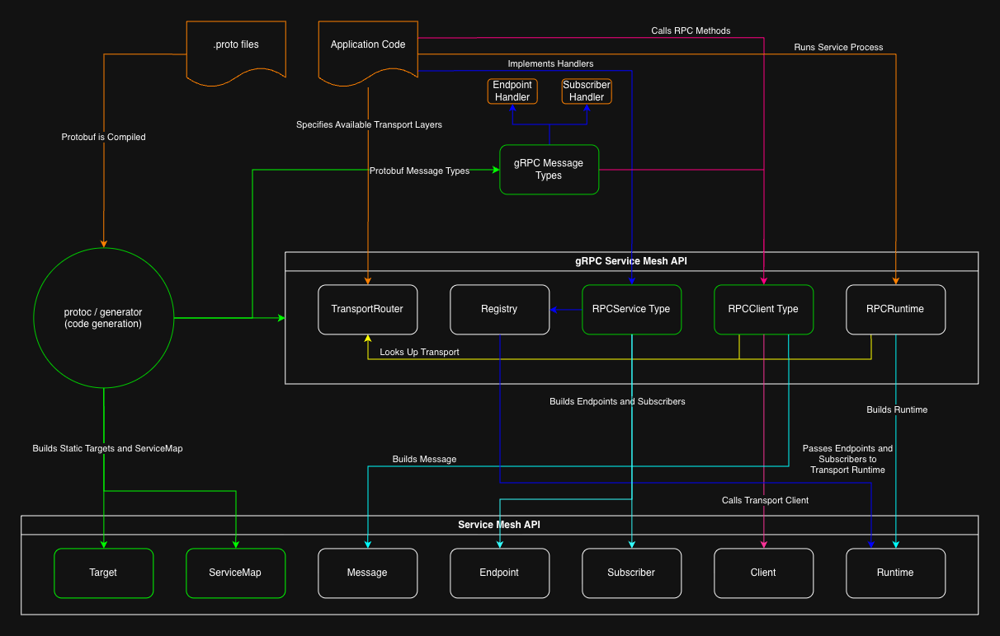

# gRPC Service Mesh API

The gRPC Service Mesh API is a service mesh protocol layer specification built on the
[Service Mesh API Specification](https://github.com/Paymentbox-com/service-mesh-api) and driven by Google Protocol
Buffers. It specifies how protobuf message and service definitions are translated into Service Mesh API primitives and
consumed at the application level.

Using this specification, libraries can be implemented across programming languages to compile the same
protobuf definitions into code that is compatible with the Service Mesh API and compatible with each other across
transports and language- and transport-specific runtimes.



## Overview

The gRPC Service Mesh API uses a generator, which reads `protoc` output to generate the necessary code to consume the
Service Mesh API. This specification defines how that generator interprets `.proto` files to generate that code. Currently
it supports Ruby and Go.

## Definitions

The only inputs required for the gRPC Service Mesh API are `.proto` files and the descriptors `protoc` produces from
them. The generator, a Go program, reads those descriptors to write the service mesh code for every language, and the
standard `protoc` plugin or built-in generator for each language writes the message types. The standard elements of a
`.proto` file are translated into Service Mesh API primitives as described below. In addition, a few options are defined to further control how the `.proto` files are
interpreted.

### Options

The gRPC Service Mesh API uses protobuf's `Options` feature to specify details about the services defined in `.proto`
files that cannot be specified by the protobuf syntax otherwise. These details include the `transport` intended to be used
for any given set of services, the `Kind` a `Target` and `Endpoint`/`Subscriber` generated from a service `rpc` method
should be, the `deployment_group` for a given set of services if the conventional default needs to be overridden, and the
`consumer_group` for any given `rpc` method.

These options are defined in `mesh/options.proto` in this repository, and are as follows:

```proto
syntax = "proto3";
package mesh;
import "google/protobuf/descriptor.proto";

option go_package = "github.com/Paymentbox-com/grpc-service-mesh-go/meshoptions";

enum Kind {
  ROUTE = 0;
  TOPIC = 1;
}

extend google.protobuf.MethodOptions {
  Kind kind = 50001;
  string consumer_group = 50002;
}

extend google.protobuf.FileOptions {
  string deployment_group = 50003;
  string transport = 50004;
  string root_prefix = 50005;
}
```

| option             | set on   | meaning                                                                                 | default                |
|--------------------|----------|-----------------------------------------------------------------------------------------|------------------------|
| `kind`             | a method | `ROUTE` replies to each request; `TOPIC` does not reply                                 | `ROUTE`                |
| `consumer_group`   | a method | the `consumer_group` of the `Target` and the `Endpoint` or `Subscriber` generated from it | the `deployment_group` |
| `deployment_group` | a file   | the `deployment_group` of every service in the file's top-level directory and the directories nested in it | the top-level directory name |
| `transport`        | a file   | the transport the file's top-level directory is served over, as a string a library resolves at runtime; this specification does not enumerate transports | none; required |
| `root_prefix`      | a file   | a prefix for every name the file's directory adds to a root package or module (see Root Package); a nested directory without its own uses its top-level directory's | none |

No option is defined at the service or method level for `transport` or `deployment_group`, so a
service cannot be split across different values, which is by design. These options are intended to be set in
their own file within the top-level directory to which they apply, such as `transport.proto` or `deployment.proto`.

Importing and using these options in your own `.proto` files is done like this. The examples also set `go_package`,
which every definitions file sets when Go code is generated from it.

```proto
// definitions/shop/deployment.proto: the directory's settings and nothing else
syntax = "proto3";
package shop;
import "mesh/options.proto";

option go_package = "example.com/definitions/shop";
option (mesh.transport) = "nats";
option (mesh.deployment_group) = "shop";   // optional; the directory name is the default
```

```proto
// definitions/shop/order.proto
syntax = "proto3";
package shop;
import "mesh/options.proto";
import "google/protobuf/empty.proto";

option go_package = "example.com/definitions/shop";

message Order {
  optional string id = 1;
  optional string item = 2;
}

service OrderService {
  rpc Place(Order) returns (Order);                          // ROUTE by default
  rpc Placed(Order) returns (google.protobuf.Empty) {
    option (mesh.kind) = TOPIC;
    option (mesh.consumer_group) = "audit";
  }
}
```

`mesh/options.proto` belongs to this specification and lives in this repository. A definitions project imports it by
that path in its own `.proto` files. Its compiled forms ship with each language-specific implementation of this
specification. The generator puts the directory of this repository at its own version on the import path of every
`protoc` run, and `grpc-service-mesh-gen proto-path` prints that directory for plain `protoc` runs, as described under
Generation.

The protobuf definitions in this repository maintain backwards compatibility. The latest version of this specification
and the generator will always hold the latest version of the options that it supports.

This specification uses certain proto definitions from `github.com/googleapis/googleapis`. Those definitions belong to
[googleapis](https://github.com/googleapis/googleapis), and their compiled forms are included in the language-specific
implementations of this specification. In the rare case when the definitions themselves need to be imported in a
definitions project, their path inside a checkout of `github.com/googleapis/googleapis` can be passed to `protoc` with
`-I`.

### Protobuf Messages

The standard `protoc` compilers produce message types for each protobuf message type defined in the `.proto` files
they are aimed at. These generated types normally implement their own binary serialization, which is used as the
`Payload` of a Service Mesh API `Message`. Conversion of the generated types to and from Service Mesh API `Message` objects
is handled behind the scenes by the `RPCClient` and `RPCService` types described below, so that the generated methods
on `RPCClient` types and the `Endpoint` and `Subscriber` handlers held by `RPCService` types only deal with the generated
types.

A Service Mesh API `Message` created from a serialized generated type carries `Content-Type: application/x-protobuf` in
its metadata.

### Protobuf Services

Protobuf services defined in `.proto` files have their `rpc` methods translated into Service Mesh API `Targets`, and the
services themselves are compiled into both an `RPCClient` type and an `RPCService` type.

The `Targets` of every service are compiled into one `ServiceMap` per `transport`, holding a `Target` for every `rpc`
method served over that transport across all deployment groups.

An `RPCClient` type holds a client method for each `rpc` method in the proto definition, and an `RPCService` either
accepts or stubs out a handler for each `rpc` method in the proto definition. Each handler is either an `Endpoint` or a
`Subscriber` handler, depending on the `Kind` option set on the method in its proto definition (the default is `ROUTE`).

A method whose `Kind` is `TOPIC` has no reply, but protobuf requires every `rpc` to declare a return type, so a topic
method declares one anyway, conventionally `google.protobuf.Empty` which ships inside `protoc` and is imported with
`import "google/protobuf/empty.proto"`. That type, or any other type that is returned from a method with `TOPIC` as its
`Kind`, is ignored everywhere. A publish sends only the request message without looking or waiting for a reply, the
subscriber's handler returns nothing, and the generated client method returns no value.

## Definitions Project Structure

The gRPC Service Mesh API convention for definitions projects is to have a `definitions` directory that the generator is
pointed at, with a nested directory for each `deployment_group`. The name `definitions` is a convention; the generator
takes the path of any directory. Each top-level directory within `definitions/` must
have a `transport` defined for it, as in the example above, if it contains at least one `service`. Likewise,
`deployment_group` is only meaningful in a directory that contains at least one `service`, but it takes a default from
the directory name.

Nested directories within a top-level directory inherit its `deployment_group` and `transport`, and set neither
themselves.

A directory that declares no `service`, such as one holding message types several deployment groups share, is valid
and needs no `transport`. Its messages are generated as usual, and it gets no mesh file.

Every file in one directory belongs to one generated package. When Go is generated, every file sets `go_package`, and
every file in a directory sets the same value.

Exactly one file in each top-level directory sets `transport`. The value is the name the application configures in the
`TransportRouter` (described below) for that transport, for example `nats` or `http`. The generator copies the string
into the generated code without interpreting it, and the `TransportRouter` resolves it at runtime against the configured
transports.

```
definitions/
├── shop/                      # deployment group "shop"
│   ├── deployment.proto       # option (mesh.transport) = "nats"
│   ├── order.proto            # package shop; OrderService
│   └── internal/
│       └── audit.proto        # package shop.internal; inherits deployment group "shop" and transport "nats"
└── billing/                   # deployment group "billing"
    ├── deployment.proto       # option (mesh.transport) = "http"
    └── invoice.proto          # package billing; InvoiceService
```

## Generation

The generator is the Go program `grpc-service-mesh-gen` in this repository:

```sh
go install github.com/Paymentbox-com/grpc-service-mesh-api/cmd/grpc-service-mesh-gen@v0.6.0
grpc-service-mesh-gen --definitions definitions --go_out=lib/go --ruby_out=lib/ruby
```

It compiles each language's message code with `protoc`, then writes the mesh code. Each directory that declares a
`service` gets one mesh file per language beside its message code, and each language's output root gets the service
maps. Every generated file starts with a `DO NOT EDIT` header and is overwritten on each run. Generated code depends on
the language library and the Service Mesh API contract, and never on a transport. The tools it runs are listed under
Prerequisites.

| flag | meaning |
|---|---|
| `--definitions <dir>` | the definitions directory |
| `--go_out=<dir>`, `--ruby_out=<dir>` | a language's output directory, as `protoc` takes it; each one given requests that language |
| `-I <dir>` | an extra import directory, repeatable; also spelled `--proto_path` |
| `--mesh-only` | write only the mesh code and skip the message code |
| `--go-root-package <path[;name]>`, `--ruby-root-module <Module>` | add a root file, described under Root Package |
| `--verbose` | print each `protoc` command and each file written |

### Import Path

Every `protoc` run imports from `definitions` first, then the specification directory, then each `-I` directory in
order, and compiles only the files under `definitions`. The specification directory is this repository's module at the
generator's own version, taken from the Go module cache, and holds `mesh/options.proto`. `grpc-service-mesh-gen
proto-path` prints it. A development build run from a checkout of this repository uses the checkout. A project whose
files import `google/rpc/*.proto` adds `-I` for a checkout of `github.com/googleapis/googleapis`.

### Compiling Message Code with Plain protoc

The generator's message code is exactly what plain `protoc` writes, so a project can compile its message code itself
and run the generator with `--mesh-only` for the rest:

```sh
spec="$(grpc-service-mesh-gen proto-path)"
protoc -I definitions -I "$spec" --go_out=lib/go --go_opt=paths=source_relative $(find definitions -name '*.proto')
protoc -I definitions -I "$spec" --ruby_out=lib/ruby $(find definitions -name '*.proto')
grpc-service-mesh-gen --definitions definitions --go_out=lib/go --ruby_out=lib/ruby --mesh-only
```

The commands list only the files under `definitions`, because the compiled form of `mesh/options.proto` comes from
the language's implementation of this specification, as described under Options.

### Generated Packages

Mesh code goes into the same package as the directory's message code. In Go that is the directory's `go_package`, so
every file under `definitions` sets `go_package` when Go is generated, and every file in one directory sets the same
value. In Ruby it is `ruby_package` when set, and otherwise the module `protoc` derives from the proto package: each
dot-separated part capitalized and nested, so `shop.internal` is `Shop::Internal`.

### Root Package

The `--go-root-package <import path[;name]>` and `--ruby-root-module <Module>` options specify a root package name
that re-exports every generated message, enum, service, client, and targets value under one namespace, so an
application imports one package for convenience.

```sh
grpc-service-mesh-gen --definitions definitions --go_out=lib/go --ruby_out=lib/ruby \
    --go-root-package "example.com/definitions;definitions" --ruby-root-module Definitions
```

```
lib/go/definitions.grpcmesh.go      type Order = shop.Order, var OrderClient = shop.OrderClient, ...
lib/ruby/definitions_grpcmesh.rb    Definitions::Order = ::Shop::Order, Definitions::OrderClient = ::Shop::OrderClient, ...
```

A re-exported name is the name its directory's package gives it, so two directories that generate the same name
collide and the generator stops with an error. `option (mesh.root_prefix)`, set in one file of a directory, prepends a
prefix to every name that directory adds to the root files, and the directory's own package keeps its names. With
`option (mesh.root_prefix) = "Billing";` in `definitions/billing/deployment.proto`, billing's `Order` is
`definitions.BillingOrder` and `Definitions::BillingOrder` in the root files, while shop's stays `definitions.Order`.

### Generator Errors

The generator stops with an error when:

* the definitions tree declares no `service`.
* a `.proto` file declares no `package`.
* a top-level directory with a `service` sets `transport` in no file or in more than one.
* a top-level directory sets `deployment_group` to two different values.
* a nested directory sets `transport` or `deployment_group`.
* a file at the definitions root declares a `service` or sets `transport` or `deployment_group`.
* an `rpc` method uses `stream` on its request or its response.
* Go is requested and a file sets no `go_package`, which `protoc-gen-go` requires.
* two files in one directory set different `go_package` values; the directory's mesh file lives in one package.
* a root package is requested and two files generate the same name.
* the Go root package's name equals a directory package's name, or the Ruby root module equals a generated module or
  `ServiceMaps`.
* two files in one directory set `root_prefix`, or its value is not an identifier starting with an uppercase letter.

### Generated Service Mesh API Primitives

#### Targets

Each `rpc` method becomes one Service Mesh API `Target`, and how the attributes of a `Target` are derived is as follows:

| field      | value                                                                 |
|------------|-----------------------------------------------------------------------|
| `segments` | the proto package split on `.`, then the service name, then the method name |
| `kind`     | `route` for `ROUTE`, `topic` for `TOPIC`                              |
| `metadata` | `deployment_group` from the directory's option or its name, `transport` from the directory's option, and `consumer_group` from the method's option when set |

For the `OrderService` shown under Options, in `examples/shop/` with `transport = "nats"`, the two `Targets` would be:

| field      | `Place`                                        | `Placed`                                                              |
|------------|------------------------------------------------|-----------------------------------------------------------------------|
| `segments` | `["shop", "OrderService", "Place"]`            | `["shop", "OrderService", "Placed"]`                                  |
| `kind`     | `route`                                        | `topic`                                                               |
| `metadata` | `deployment_group=shop`, `transport=nats`      | `deployment_group=shop`, `transport=nats`, `consumer_group=audit`     |

`Targets` are built at generation time and emitted as constants. Nothing reads options at runtime.

#### ServiceMaps

A `ServiceMap` is simply a list of `Targets`, as defined by the Service Mesh API Specification. The gRPC Service Mesh API
requires one `ServiceMap` per `transport`, each holding only the `Targets` using that `transport`. The transport's map is
what a `Client` for that transport accepts on construction, and a `Runtime` built from that `Client` serves with it.

The per-transport `ServiceMaps` are written to one package at the output root per language. In Go it is
`servicemaps/servicemaps.go`, package `servicemaps`, exporting one `mesh.ServiceMap` var per transport named by
PascalCasing the transport string, such as `servicemaps.Nats`. In Ruby it is `service_maps.rb`, defining
`ServiceMaps::<TRANSPORT>` with the transport string in SCREAMING_SNAKE_CASE, such as `ServiceMaps::NATS`. That package
imports the directory packages for their `Target` values.

#### RPCService Types

For each service defined in a `.proto` file, the generator emits an `RPCService` type, which provides a way for each of that service's
`rpc` method handlers to be implemented by application code. It then outputs `Endpoints` and/or `Subscribers` that contain those handlers,
and they are what the transport-specific `Runtime` accepts alongside the transport's `Client`.

The handlers for `Endpoints` and `Subscribers` differ in their return value:

| kind    | handler signature                                                                                                        |
|---------|--------------------------------------------------------------------------------------------------------------------------|
| `ROUTE` | `(context, <RequestType>) -> (<ResponseType>) [May return or raise a MeshError, depending on language/implementation]`   |
| `TOPIC` | `(context, <RequestType>) [May return or raise a MeshError, depending on language/implementation]`                       |

`<RequestType>` and `<ResponseType>` are the compiled message types for each `rpc` method.

An application implements only the method handlers it intends to serve. Decoding the inbound Service Mesh API `Message`
into the proper type, and encoding a response type back into a `Message` is handled automatically so that the
application doesn't need to touch the underlying layer.

An `RPCService` type keeps the name of the service it is generated from, such as `OrderService`. A root file may
re-export it under a prefixed name, as described under Root Package, and the type itself keeps its name.

#### RPCClient Types

For each service the generator also emits an `RPCClient` type with one method per `rpc` method, through which
callers reach the service. These methods have different method signatures based on the `Kind` they are defined
with.

| kind    | client method signature                                                                                      | Service Mesh API operation |
|---------|--------------------------------------------------------------------------------------------------------------|----------------------------|
| `ROUTE` | `(context, Request) -> (Response) [May return or raise a MeshError, depending on language/implementation]`   | `Request`                  |
| `TOPIC` | `(context, Request) [May return or raise a MeshError, depending on language/implementation]`                 | `Publish`                  |

A `ROUTE` or `TOPIC` method encodes the standard, generated type into a `Message` addressed to the method's `Target` and sends that
message through the appropriate transport-specific client that implements the Service Mesh API specification. A `ROUTE`
method will get a `Message` back and decode it back into the standard, generated response type, then return that type.

An `RPCClient` holds no connection of its own. On each call it must resolve the transport-specific `Client` that
serves the `Target`'s transport using the `TransportRouter` (described below).

A client type's name is the service's name with a trailing `Service` removed, if it has one, and `Client` appended:
`OrderService` gives `OrderClient`. The generated code also holds each service's `Targets` under the same base name
with `Targets` appended, such as `OrderTargets`; the generated clients and services use them, and applications do not
need to.

## Non-Generated Types

Each language-specific implementation of this specification will need to implement the following types, which are not
generated off of `.proto` files.

### TransportRouter

The `TransportRouter` contains, for each `transport` name the definitions use, the transport-specific `Client` for that transport.
It is a single, process-wide object, and the application process is responsible for configuring it at boot. Generated
code for `RPCService` types and `RPCClient` types whose `transport` has no `Client` in the router fails at runtime. Nothing
generated takes the `TransportRouter` as an argument; a generated client is called directly and takes the `Client` for its
`Target`'s transport from the process's router on each call. The router's `Close` closes every `Client` it holds, and a
process that only calls runs it before exit so the transport implementation closes appropriately. Each language-specific
implementation of this specification documents how the `TransportRouter` is configured, and how clients are
retrieved from it using the `transport` set for each directory in a definitions project.

### Registry

The `Registry` is a single, process-wide object that collects every implemented `Endpoint` and `Subscriber` a process
will serve. The application is responsible for registering its implemented `RPCService` values in it at boot, and nothing
generated takes the `Registry` as an argument. This specification defines what it does; each language-specific implementation
of this specification documents how services are registered.

### RPCRuntime

The `RPCRuntime` is what a service mesh application calls to begin listening for messages, and it is a wrapper around a
transport-specific Service Mesh API `Runtime` implementation. It should either wrap or expose the underlying implementation's
functionality.

An `RPCRuntime` is constructed for a single `transport` and a single `deployment_group`. It accepts a constructor
function for building the transport-specific `Runtime` and a `Hash<String, String>` configuration object. It takes the
transport's `Client` from the `TransportRouter`. By default it takes every implemented `Endpoint` and `Subscriber`
whose `Target` carries its `deployment_group` from the `Registry`, and it also accepts a list of `Endpoints` and a list
of `Subscribers` in place of those, so a process may serve only part of a deployment group if needed. Each list given
replaces the `Registry`'s list of that kind, and the other still comes from the `Registry`. Every `Target` in a given
list carries the `RPCRuntime`'s `deployment_group` and `transport`, and one that does not is an error.

The `Runtime` constructor provided must accept four arguments in this order: the transport's `Client`, a `Hash<String, String>`
configuration object, a list of `Endpoints`, and a list of `Subscribers`. It returns a Service Mesh API `Runtime` for the given
`transport` serving those `Endpoints` and `Subscribers`. The `RPCRuntime` passes the `Client` it looks up from the `TransportRouter`,
the configuration it was given with its `deployment_group` set, and the `Endpoints` and `Subscribers` it serves.

### MeshError

`MeshError` is the error type every implementation provides for application failures. An `RPCService` handler
produces one to report a failure, and an `RPCClient` method produces one when the reply carries a failure. It wraps the
standard `google.rpc.Status` message and adds what the language needs for the calling code to treat it as an error.

| member       | meaning                                                                                  |
|--------------|------------------------------------------------------------------------------------------|
| `code`       | a `google.rpc.Code`                                                                      |
| `message`    | human-readable text                                                                      |
| `details`    | the wrapped message's `details`, any number of packed messages of any type               |
| `proto`      | the wrapped `google.rpc.Status`                                                          |

A `MeshError` is constructed from a code, a message, and zero or more detail messages, or from a
`google.rpc.Status` message. It is the language's error type: in Go it implements `Error`, in Ruby it descends from
`StandardError`, and so on. Each language-specific implementation documents its language-specific features and construction.

The compiled classes for `google.rpc.Status`, `google.rpc.Code`, and the detail types in `google/rpc/error_details.proto`
are a dependency of each implementation, taken from the standard published packages for the language. Their `.proto`
sources are in `github.com/googleapis/googleapis`, which a definitions project whose files import them puts on its
import path with `-I`, as described under Options.

## Encoding and Decoding

The code generated by this specification's generator handles the encoding and decoding of protobuf message types behind
the scenes. The `rpc` methods generated on `RPCClient` types accept the generated message types themselves and return those
types, but serialize them into bytes when constructing the Service Mesh API `Message` object that gets passed to the
transport-specific `Client`. The same happens for `RPCService` type handlers, which are wrapped with logic that deserializes
the Service Mesh API `Message` into the proper typed generated message, and serializes any replies that are returned.

## Error Handling

Every call through an `RPCClient` may produce a `MeshError`. Errors from the Service Mesh API
and from the transport, such as no receiver for a `Target` or a request timeout, are surfaced to the caller unchanged;
this specification does not map them into a `MeshError`.

**Reporting.** A `ROUTE` handler reports an application failure by producing a `MeshError` in place of a response, and a
language-specific implementation should provide an idiomatic way of doing this. The `RPCService` then sends a reply whose
payload is the encoded `google.rpc.Status` and whose metadata carries `Grpc-Status` set to the code as a decimal integer.
A `ROUTE` handler that fails in any other way is reported as `UNKNOWN` with the failure's text as the message. A `TOPIC`
handler has no caller, so it handles application errors itself; nothing it returns reaches the publisher, and what an
implementation does when one fails is documented by that implementation.

**Decoding.** An `RPCClient` reads `Grpc-Status` from the reply metadata before touching the payload. If it is set, it assumes
the payload is a `google.rpc.Status` and a `MeshError` is produced and surfaced accordingly. If it is not set, it assumes the
payload is the method's response type and decodes it normally. A payload that does not decode as the expected type produces
an `INTERNAL` `MeshError`.

**Custom errors.** A consumer may define its own error types as ordinary `.proto` messages in its definitions and attach them
to a `MeshError` through `details`, and a language-specific implementation may provide helper functions or other support
for doing this. `google/rpc/error_details.proto` provides common detail types such as `ErrorInfo`, `BadRequest`, and
`RetryInfo`. Custom errors are defined as protobuf messages so that they can be used across languages.

## Using the Generator

### Prerequisites

| tool | needed for | install |
|---|---|---|
| Go 1.26 or newer | installing and running the generator | [go.dev/dl](https://go.dev/dl) |
| `protoc` 3.15 or newer | every run | macOS: `brew install protobuf`. Linux: `apt install protobuf-compiler` or `dnf install protobuf-compiler`. Any platform, including Windows: unzip `protoc-<version>-<os>.zip` from [protocolbuffers/protobuf releases](https://github.com/protocolbuffers/protobuf/releases) and put its `bin/` on `PATH`. |
| `protoc-gen-go` | generating Go | `go install google.golang.org/protobuf/cmd/protoc-gen-go@latest` |

Ruby needs no plugin; Ruby support is built into `protoc` itself.

### Installing and Running

```sh
go install github.com/Paymentbox-com/grpc-service-mesh-api/cmd/grpc-service-mesh-gen@v0.6.0
grpc-service-mesh-gen --definitions definitions --go_out=lib/go --ruby_out=lib/ruby
```

`go run github.com/Paymentbox-com/grpc-service-mesh-api/cmd/grpc-service-mesh-gen@v0.6.0` runs it without installing.
The flags are described under Generation.

Each output directory mirrors the definitions tree. For `definitions/shop/order.proto` the generator writes:

```
lib/go/shop/order.pb.go             message code
lib/go/shop/shop.grpcmesh.go        OrderTargets, OrderService, OrderClient
lib/go/servicemaps/servicemaps.go   one ServiceMap per transport
lib/ruby/shop/order_pb.rb           message code
lib/ruby/shop/shop_grpcmesh.rb      Shop::OrderTargets, Shop::OrderService, Shop::OrderClient
lib/ruby/service_maps.rb            one ServiceMap per transport
```

### Regenerating

The generator overwrites the files it writes but doesn't delete anything if it becomes orphaned. A project's own automation
can delete its generated files before each run, so that the output of a renamed or removed `.proto` file does not linger.
Every generated file begins with a `DO NOT EDIT` header, which makes them easy to find:

```sh
grep -rl --include='*.go' --include='*.rb' 'DO NOT EDIT' lib | xargs rm -f
grpc-service-mesh-gen --definitions definitions --go_out=lib/go --ruby_out=lib/ruby
```

Generated code should be committed, so the applications that use it need neither `protoc` nor the generator at runtime.

## Using a Definitions Project in Service Mesh Applications

A definitions project is a `definitions/` directory, laid out as described under Definitions Project Structure, plus
the directories the generated code goes into. It can live inside the repositories of the applications that use it as a
git submodule, or as its own repository that exposes the generated code as packages or libraries that the applications
on a service mesh import. Either way, the application will need to include the language-specific library that implements
this specification at runtime, as the generated code will depend on it. See current implementation libraries below. Each
implementation will document its own usage and how to integrate it into an application.

## Implementations

- [grpc-service-mesh-go](https://github.com/Paymentbox-com/grpc-service-mesh-go): the Go library, package `grpcmesh`.
- [grpc-service-mesh-ruby](https://github.com/Paymentbox-com/grpc-service-mesh-ruby): the Ruby library, gem `grpc_service_mesh`.
